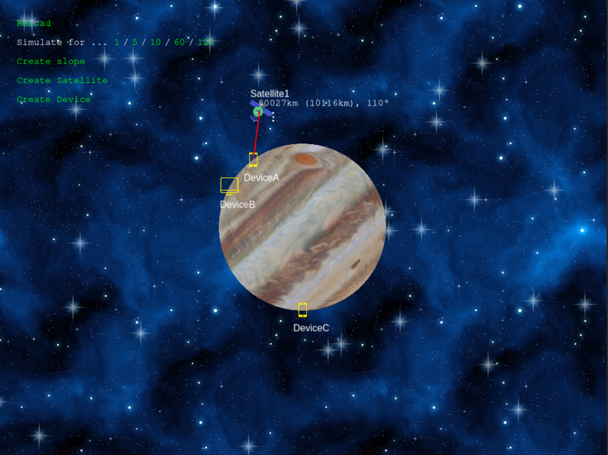
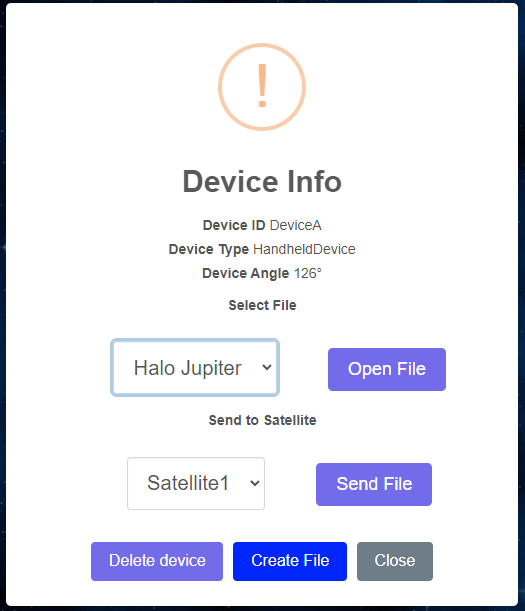
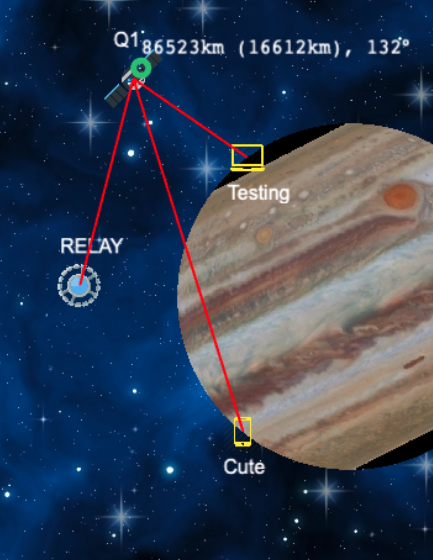
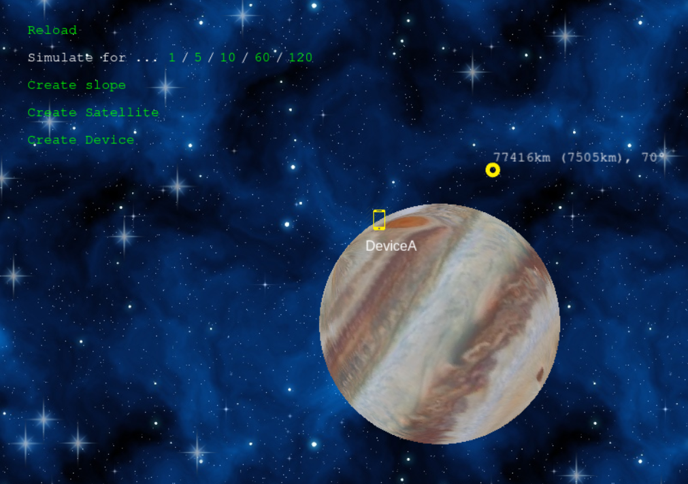
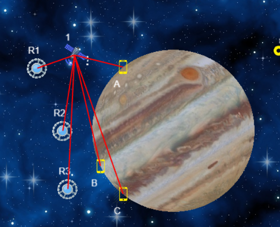
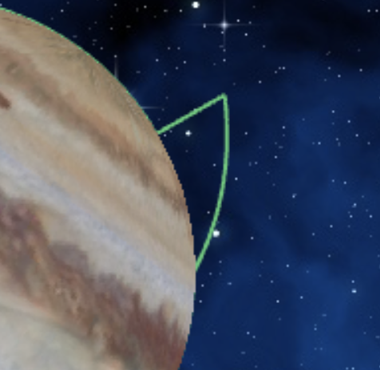

# Assignment-i

## Due: Week 5 Friday, 5pm AEST (13th October)

[[_TOC_]]

## Value: 15% of the Course Mark

**What is this assignment aiming to achieve?**

Assignment I is your first exposure to building a medium scale system from scratch. You’ll need to analyse the requirements, model the domain, and design a solution using the Object-Oriented Programming principles discussed in the course.

The aims of this assignment can be broken down into five major themes:

1.  **Understanding the Problem Space**. Problem spaces in which we build software can often be very complex. This assignment involves some geospatial and mathematical ideas (though you won’t have to do any mathematical derivation yourself) with a series of multifaceted interacting entities. Take some time to understand the problem by reading the spec a few times and clarifying anything you need to.
2.  **Thoughtful Planning**. You’ll need to model the domain by defining the entities present in the domain and their relationships. Start with a very rough pen and paper draft of this, you’ll be able to iterate on your design as you become more familiar with the problem space.
3.  **Programming by Contract**. The specification outlines everything you have to implement - you’ll need to implement your solution according to the rules and test your solution to ensure correctness.
4.  **Robust Programming**. In developing the system, you will need to maintain good quality programming practices including code style as well as the overall design. One approach you can take is, for each task, to implement a rough solution to pass the tests, go back and refactor and make it nicely designed. Then repeat for the next task.
5.  **Building Blocks**. This assignment will build your skills in working with Java, the VSCode IDE and thinking critically that will help you throughout the rest of the course.

[**Click here to login and access your personal assignment-i repository**](https://cgi.cse.unsw.edu.au/~cs2511/redirect/?path=COMP2511/23T3/students/_/assignment-i/)

# 0. Change Log

N/A

# 1. Preamble and Problem

A great deal of today's technology uses satellites which orbit the Earth in one way or another. For example, tagging photographs with their location, telecommunications, and even missile control systems. There are currently 4,550 active satellites (as of 2022) orbiting the Earth all together.

In the far future, society has become advanced to the point where they have begun to occupy a series of moons and asteroids around the planet Jupiter. Individuals rely on satellites for all their communication desires. Three major satellites exist around Jupiter.

This assessment aims to provide you with design experience for a non-trivial system. You will be architecting and modelling how these multiple satellites will communicate and function with various devices. The form of communication that you will be simulating is a simplified version of the modern internet, simply just file transfer. You can either upload a file to a satellite from a device, download a file from a satellite to a device, or send a file from a satellite to a satellite.

Your solution should adopt an Object-Oriented approach that utilises concepts such as abstraction, encapsulation, composition, and inheritance, as taught in lectures.

There is an [introduction video available](https://thebox.unsw.edu.au/3CF51850-1B4D-11EC-9F0B728F51087198) which you can watch - some of the contents of the video relates to a previous version of the assignment but most of it is relevant and gives you an in-depth overview of the tasks and starter code.

## 1.1 A simple example

Let’s assume initially there is a `Standard Satellite` at height approximately 80,000 km above the centre of Jupiter and at θ = 128 degrees. In addition there are 3 devices; Device A, Device B, and Device C. Device A and Device C are handheld devices, whereas Device B is a desktop device.


In this system, the satellite can talk to Device A and Device A can talk to the satellite (communication is done by sending files) since they are in range of each other. Satellite A however cannot talk to Device B (and Device B cannot talk to Satellite A) because `Standard Satellite`s have restrictions on what devices they can talk to (discussed in more detail later). Finally, Satellite A cannot connect to Device C because it is not in visible sight range. The red line in the image highlights this.

In this example, devices are static and will not move, but satellites can! Satellites move based on a constant linear velocity, in this case Standard Satellites have a linear velocity of 2,500 km per minute (or 2,500,000 metres). From this, we can calculate its angular velocity based on its height (which is the radius from the center of Jupiter). For example, after 10 minutes it would have moved a total of `2,500 / 80,000 * 10 mins = 0.03125 * 10 = 0.3125 radians ~= 18 degrees`(note that we don't have to account for the fact they are measured in `km` here since the extra `10^3` component will cancel out). This means our new position is `128 - 18` which is approximately `110-111 degrees`.



Eventually after moving for a couple more minutes it will get out of range of the devices A and B.

Secondly, we need to look at interaction between satellites and devices. They can communicate through the transfer of files. Files can be transferred between satellites/devices and other satellites (files can not be directly sent from device to device).

To begin let's create a new file on a device. Clicking on Device A and pressing Create File as shown below we can create a file.


Once created, files cannot be modified/deleted, furthermore every filename has to be unique. Creating a file called `Halo Jupiter` with its contents also being `Halo Jupiter` we can view it by going to the device again and clicking Open File as shown below.


We can then send this file to our satellite by just clicking on the device ensuring the file and satellite are selected as below then clicking `Send File`.



If we then try to open the file on the satellite we notice that it is empty and says 0/12 for its size. This is because files transfers aren't instant, they are based on the bandwidth of the satellite. Standard Satellites are relatively slow, so they will take 12 minutes to send this file since they only send at 1 byte per minute. If we let it run for at least 12 minutes and look again we will see the file has finished sending.


We could then continue this by running the simulation a little longer and letting the satellite orbit around to Device C and then sending the file down to Device C.

## 1.2 Simulation

A simulation is an incremental process starting with an initial world state, say WorldState_00. We add a specified time interval of 1 minute and calculate the new positions of all the satellites after the minute. We then go and update all the connections accordingly to derive the next world state WorldState_01. Similarly, we derive WorldState_02 from WorldState_01, WorldState_03 from WorldState_02, and so on. This act of feeding a world state into the next forms a sort of state machine. A similar example of this is [https://playgameoflife.com/](https://playgameoflife.com/).

`WorldState_00 -> WorldState_01 -> WorldState_02 -> …`

In our case our simulation runs at an accuracy of 1 minute and each state transition will take only 1 minute.

# 2. Requirements 🪐

> ℹ  NOTE: This problem will not require any heavy use of mathematics, you will be provided with a library that will perform all the calculations for you.

There are three tasks set out for you.

1.  Model the problem, including:
    - Modelling the satellites/devices;
    - Satellites/Devices must be able to be added/removed at runtime (with various consequences);
    - Most importantly, write a series of 'queries' about the current world state such as what devices currently exist.
2.  Allow satellites/devices to send files to other satellites.
3.  Implement moving devices.

## 2.1 Assumptions

In this problem, we are going to have to make some assumptions. Let us assume that:

- Satellites move around at a constant linear velocity regardless of their distance from the planet (their angular velocity would change based upon the distance, though).
- The model is two dimensional
- Objects do not rotate on their axis and simple planetary orbit is the only 'rotation' that is allowed in the system.
- Jupiter has a radius of `69,911` kilometres.

For the sake of consistency:

- All distances are in kilometres (`1 km = 1,000 m`).
- Angular velocity is in radians per minute (not per second).
- Linear velocity is in kilometres per minute (not per second).

## 2.2 Devices 🖨️

There are three types of devices available. Each device has a maximum range from which it can connect to satellites.

- `HandheldDevice` – phones, GPS devices, tablets.
  - Handhelds have a range of only 50,000 kilometres (50,000,000 metres)
- `LaptopDevice` – laptop computers.
  - Laptops have a range of only 100,000 kilometres (100,000,000 metres)
- `DesktopDevice` – desktop computers and servers.
  - Desktops have a range of only 200,000 kilometres (200,000,000 metres)

## 2.3 Files 📨

Devices can store an infinite number of files and can upload/download files from satellites. Files are represented simply by just a string representing their content and a filename representing their name.

All files can be presumed to purely consist of alphanumeric characters or spaces (i.e. a-z, A-Z, 0-9, or spaces) and filenames can be presumed to be unique (i.e. we will never create two files of the same name with different content). Furthermore, since we are dealing with such a simple subset, 1 character is equivalent to 1 byte. We will often refer to the size of files in terms of bytes, and the file size only relates to the content of the file (and not the filename).

To send files the target needs to be within the range of the source BUT the source does not have to be within the range of the target. For example, if a `HandheldDevice` (range `50,000 km`) is `100,000 km` away from a `StandardSatellite`(range `150,000 km`) it can't send files to the satellite but it can receive files from the satellite. If the device is `160,000 km` away from the satellite neither can interact with each other. Satellites can also send files to other satellites but devices can not send files to other devices.

Files do not send instantly however, and are limited by the bandwidth of the satellites. Satellites will always ensure fairness and will evenly allocate bandwidth to all currently uploading files (for example, if a satellite has a bandwidth of 10 bytes per minute and 3 files, every file will get 3 bytes per minute. You'll have 1 unused byte of bandwidth). Devices aren't limited on the number of downloads/uploads they can do.

If a device goes out of range of a satellite during the transfer of a file (either way) the partially downloaded file should be removed from the recipient. This does raise the question of whether or not you should start transferring a file if it's obvious that it won't finish. Solving this problem is mostly algorithmic and isn't particularly interesting to the point of this assignment so you don't have to do anything special here: if someone asks to transfer a file... begin to transfer it.

During a file transfer, in the case where sending speed and receiving speed are different, the transfer rate is bottlenecked by `min(sending speed, receiving speed)`.

## 2.4 Satellites 🛰️

There are 2 specialised types of satellites (and one basic one). Satellites have a set amount of bandwidth for transferring files and a set amount of storage.

Default direction for all satellites is negative (clockwise), unless otherwise specified.

- `StandardSatellite`
  - Moves at a linear speed of 2,500 kilometres (2,500,000 metres) per minute
  - Supports handhelds and laptops only (along with other satellites)
  - Maximum range of 150,000 kilometres (150,000,000 metres)
  - Can store up to either 3 files or 80 bytes (whichever is smallest for the current situation).
  - Can receive 1 byte per minute and can send 1 byte per minute meaning it can only transfer 1 file at a time.
- `TeleportingSatellite`
  - Moves at a linear speed of 1,000 kilometres (1,000,000 metres) per minute
  - Supports all devices
  - Maximum range of 200,000 kilometres (200,000,000 metres)
  - Can receive 15 bytes per minute and can send 10 bytes per minute.
  - Can store up to 200 bytes and as many files as fits into that space.
  - When the position of the satellite reaches θ = 180, the satellite teleports to θ = 0 and changes direction.
  - If a file transfer **from a satellite to a device or a satellite to another satellite** is in progress when the satellite teleports, the rest of the file is instantly downloaded, however all `"t"` letter bytes are removed from the remaining bytes to be sent.
    - For the satellite to satellite case, the behaviour is the same whether it is the sender or receiving that is teleporting
  - If a file transfer **from a device to a satellite** is in progress when the satellite teleports, the download fails and the partially uploaded file is removed from the satellite, _and_ all `"t"` letter bytes are removed from the file on the device.
  - There is no 'correction' with the position after a teleport occurs as there is for Relay Satellites (see below). Once the satellite teleports to θ = 0 it does not continue moving for the remainder of the tick.
  - Teleporting satellites start by moving anticlockwise.
- `RelaySatellite`
  - Moves at a linear velocity of 1,500 kilometres (1,500,000 metres) per minute
  - Supports all devices
  - Max range of 300,000 kilometres (300,000,000 metres)
  - Cannot store any files and has no bandwidth limits
  - Devices/Satellites cannot transfer files directly to a relay but instead a relay can be automatically used by satellites/devices to send to their real target
    - For example if a `HandheldDevice` (range `50,000km`) is `200,000km` away from a `StandardSatellite`that it wishes to communicate with, it is able to communicate to the satellite through the use of the relay if the relay is within `50,000km` of the device and the satellite is within `300,000km` (the range of the relay) of the relay.
    - Files being transferred through a relay should not show up in the relay's list of files.
  - Only travels in the region between `140°` and `190°`
    - When it reaches one side of the region its direction reverses and it travels in the opposite direction.
      - This 'correction' will only apply on the next minute. This means that it can briefly exceed this boundary. There is a unit test that details this behaviour quite well-called `testRelaySatelliteMovement` in `Task2ExampleTests.java`
    - You can either do the radian maths here yourself or use the functions in `src/unsw/utils/Angle.java` to do comparisons.
    - In the case that the satellite doesn't start in the region `[140°, 190°]`, it should choose whatever direction gets it to the region `[140°, 190°]` in the shortest amount of time.
      - As a hint (and to prevent you having to do maths) this 'threshold' angle is `345°`; if a relay satellite starts on the threshold `345°` it should take the positive direction.
      - You can assume that we don’t create any satellite at 140 and 190 degree in our tests (this behaviour’s undefined)
    - Relay satellites don't allow you to ignore satellite requirements (other than visibility/range), for example you can't send a file from a Desktop Device to a Standard Satellite due to the fact that a Standard Satellite doesn't support Desktops. This should hold _even if_ a Relay is used along the way.
  - HINT: because there are no bandwidth limits and you don't have to show any tracking of files that go through the relay. Keep it simple! Don't over-engineer a solution for this one. You'll notice that the frontend when drawing connections that utilise relays don't go through the relay as shown below.



<table data-layout="default" data-local-id="6f848219-9cd6-4b72-ac61-1df5168af814" class="confluenceTable"><colgroup><col style="width: 680.0px;"></colgroup><tbody><tr><th class="confluenceTh"><p>ℹ  To save you some googling <code>v = r * ω</code> (where <code>v</code> is linear velocity i.e. kilometres per minute, <code>ω</code> is angular velocity i.e. radians per minute, and <code>r</code> is the radius / height of the satellite in km).</p></th></tr></tbody></table>

## 2.5 Visualisation 🎨

To help you understand this problem we've made a frontend for the application you are writing, we also have a sample implementation for you to refer to. You'll also find that the starter code will have a simple webserver to run this frontend for you (already written) such that you can run the UI locally.

[Assignment Sample Implementation](http://cs2511-23t3-assignment-i-sample-env.eba-372wevef.ap-southeast-2.elasticbeanstalk.com/app/)

This is _NOT_ necessary for you to get marks, and it is more there just for those that enjoy seeing something slowly come together as they complete tasks. It's possible and still quite nice to just use the reference implementation + JUnit tests to design and build your solution without ever having to run and test the UI locally.

<table data-layout="default" data-local-id="d3075dd5-64db-4750-bc0d-4994bf327734" class="confluenceTable"><colgroup><col style="width: 680.0px;"></colgroup><tbody><tr><th class="confluenceTh"><p>⚠  As with any software, bugs could exist in either the frontend or the sample implementation. Thus you should treat the specification as the final word and <em>not</em> the sample implementation. If you do notice any bugs or issues, please raise it on the forum so it can get fixed (or a workaround will be provided). Furthermore as the frontend expects that <em>most</em> of the code follows the specification you may run into weird bugs if you have wildly different behaviour.</p></th></tr></tbody></table>

Functionality is listed below;

- You can click on a satellite or a device to view its properties, as well as all the files it currently has, send files to other satellites, create files if it's a device, delete the entity as well as copy the numbers to help in your testing.
- You can mouse over any satellite/device to see all the possible targets
- You can click on anything near the radius of Jupiter to create a device and anywhere else in space to create a satellite
- You can also use the buttons in the top left to create device or satellite at an exact position/height
- There are buttons on the top left to refresh the screen (for whatever reason) as well as run simulations for set periods of time
  

If your backend throws any exceptions an error will popup in the UI and an error log will be in the Java output window in VSCode (except for transferring file tasks which require the throwing of _certain_ exceptions).

# 3. Program Structure

<table data-layout="full-width" data-local-id="3f2e65c9-3877-4d96-919e-c70776e14fc6" class="confluenceTable"><colgroup><col style="width: 284.0px;"><col style="width: 284.0px;"><col style="width: 284.0px;"><col style="width: 284.0px;"></colgroup><tbody><tr><th class="confluenceTh"><p><strong>File</strong></p></th><th class="confluenceTh"><p><strong>Path</strong></p></th><th class="confluenceTh"><p><strong>Description</strong></p></th><th class="confluenceTh"><p><strong>Should you need to modify this?</strong></p></th></tr><tr><td class="confluenceTd"><p><code>BlackoutController.java</code></p></td><td class="confluenceTd"><p><code>src/unsw/blackout/BlackoutController.java</code></p></td><td class="confluenceTd"><p>Contains one method for each command you need to implement.</p></td><td class="confluenceTd"><p><strong>Yes.</strong></p></td></tr><tr><td class="confluenceTd"><p><code>App.java</code></p></td><td class="confluenceTd"><p><code>src/App.java</code></p></td><td class="confluenceTd"><p>Runs a server for blackout.</p></td><td class="confluenceTd"><p><strong>No.</strong></p></td></tr><tr><td class="confluenceTd"><p><code>MathsHelper.java</code></p></td><td class="confluenceTd"><p><code>src/unsw/utils/MathsHelper.java</code></p></td><td class="confluenceTd"><p>Contains all the math logic that you'll require.</p></td><td class="confluenceTd"><p><strong>No.</strong></p></td></tr><tr><td class="confluenceTd"><p><code>Angle.java</code></p></td><td class="confluenceTd"><p><code>src/unsw/utils/Angle.java</code></p></td><td class="confluenceTd"><p>Contains an abstraction for angles that lets you easily convert between radians/degrees without having to worry about what 'state' it is currently in.</p></td><td class="confluenceTd"><p><strong>No.</strong></p></td></tr><tr><td class="confluenceTd"><p><code>EntityInfoResponse.java</code>and <code>FileInfoResponse.java</code></p></td><td class="confluenceTd"><p><code>src/unsw/response/models/EntityInfoResponse.java</code>and <code>src/unsw/response/models/FileInfoResponse.java</code></p></td><td class="confluenceTd"><p>Contains the result for certain functions in BlackoutController.</p></td><td class="confluenceTd"><p><strong>No.</strong></p></td></tr><tr><td class="confluenceTd"><p><code>Scintilla.java</code> and auxiliary files; <code>Environment.java</code>, <code>PlatformUtils.java</code>, and <code>WebServer.java</code></p></td><td class="confluenceTd"><p><code>src/scintilla</code></p></td><td class="confluenceTd"><p>Contains a small custom built wrapper around Spark-Java for running a web server. When run it automatically opens a web browser.</p></td><td class="confluenceTd"><p><strong>No.</strong></p></td></tr><tr><td class="confluenceTd"><p><code>Task1ExampleTests.java</code></p></td><td class="confluenceTd"><p><code>src/test/Task1ExampleTests.java</code></p></td><td class="confluenceTd"><p>Contains a simple test to get you started with Task 1.</p></td><td class="confluenceTd"><p><strong>Yes</strong>, feel free to add more tests here or just create a new testing file.</p></td></tr><tr><td class="confluenceTd"><p><code>Task2ExampleTests.java</code></p></td><td class="confluenceTd"><p><code>src/test/Task2ExampleTests.java</code></p></td><td class="confluenceTd"><p>Contains a simple test to get you started with Task 2.</p></td><td class="confluenceTd"><p><strong>Yes</strong>, feel free to add more tests here or just create a new testing file.</p></td></tr></tbody></table>

# 4. Tasks

## Task 1 - Modelling (15%) 🌎

> This task is mainly focused on design, if you start with an initial design via a rough UML Diagram on pen and paper, you'll find this will be quite straightforward! Very little logic exists in this first task.

All methods below exist in the class `src/unsw/blackout/BlackoutController.java`

### Task 1 a) Create Device

Adds a device to the ring at the position specified, the position is measured as an angle relative to the x-axis, rotating anticlockwise.

```java
public void createDevice(String deviceId, String type, Angle position);
```

### Task 1 b) Remove Device

Removes a device (specified by id). You don't need to cancel all current downloads/uploads (relevant for Task 2).

```java
public void removeDevice(String deviceId);
```

### Task 1 c) Create Satellite

Creates a satellite at a given height (measured from centre of Jupiter) at a given angle.

```java
public void createSatellite(String satelliteId, String type,
                            double height, Angle position);
```

### Task 1 d) Remove Satellite

Removes a satellite from orbit. You don't need to cancel all current downloads/uploads (relevant for Task 2).

```java
public void removeSatellite(String satelliteId);
```

### Task 1 e) List all device ids

Lists all the device ids that currently exist.

```java
public List<String> listDeviceIds();
```

### Task 1 f) List all satellite ids

Lists all the satellite ids that currently exist.

```java
public List<String> listSatelliteIds();
```

### Task 1 g) Add file to device

Adds a file to a device (not a satellite). Files are added instantly.

```java
public void addFileToDevice(String deviceId, String filename, String content);
```

### Task 1 h) Get device/satellite information

Get detailed information about a single device or a satellite.

> ℹ  NOTE: ids are unique, so no 2 devices and/or satellites can have the same id.

```java
public EntityInfoResponse getInfo(String id);
```

`EntityInfoResponse` is a struct that is supplied that contains the following members (it also comes with a constructor and a getter).

```java
public final class EntityInfoResponse {
  /**
   * The unique ID of the device.
   **/
  private final String id;

  /**
   * The angular position of the entity in radians
   **/
  private final Angle position;

  /**
   * The height of the entity measured in kilometres
   * devices will have a height equal to the radius of Jupiter.
   */
  private final double height;

  /**
   * the type of the entity i.e. DesktopDevice, StandardSatellite, ...
   **/
  private final String type;

  /**
   * A map of all the files that this entity has access to.
   * The key is the name of the file.
   **/
  private final Map<String, FileInfoResponse> files;
}
```

> ℹ  NOTE: <code>final</code> for classes means it can't have subclasses, <code>final</code> for functions means they can't have overrides, and final for members means they can't be modified after the constructor. You don't have to use it in the assignment.

> <code>Map&lt;..&gt;</code> is similar to Dictionaries in Python and acts as a mapping between a key and a value. You can find more information

### Task 1 Example

You can test your implementations for Task 1 using the simple test provided in the file `src/test/Task1ExampleTests.java`. Later you need to add more tests to properly test your implementations.

The method `testExample` uses a JUnit test to test a few world states. Please read the method `testExample`.

```java
@Test
public void testExample() throws FileTransferException {
    // Task 1
    // Example from the specification
    BlackoutController controller = new BlackoutController();

    // Creates 1 satellite and 2 devices
    // Gets a device to send a file to a satellites and gets another device to download it.
    // StandardSatellites are slow and transfer 1 byte per minute.
    controller.createSatellite("Satellite1", "StandardSatellite", 10000 + RADIUS_OF_JUPITER, Angle.fromDegrees(320));
    controller.createDevice("DeviceB", "LaptopDevice", Angle.fromDegrees(310));
    controller.createDevice("DeviceC", "HandheldDevice", Angle.fromDegrees(320));

    String msg = "Hi 42";
    controller.addFileToDevice("DeviceC", "FileAlpha", msg);
    controller.sendFile("FileAlpha", "DeviceC", "Satellite1");
    assertEquals(new FileInfoResponse("FileAlpha", "", msg.length(), false), controller.getInfo("Satellite1").getFiles().get("FileAlpha"));

    controller.simulate(msg.length());
    assertEquals(new FileInfoResponse("FileAlpha", msg, msg.length(), true), controller.getInfo("Satellite1").getFiles().get("FileAlpha"));

    controller.sendFile("FileAlpha", "Satellite1", "DeviceB");
    assertEquals(new FileInfoResponse("FileAlpha", "", msg.length(), false), controller.getInfo("DeviceB").getFiles().get("FileAlpha"));

    controller.simulate(msg.length());
    assertEquals(new FileInfoResponse("FileAlpha", msg, msg.length(), true), controller.getInfo("DeviceB").getFiles().get("FileAlpha"));

    // Hints for further testing:
    // - What about checking about the progress of the message half way through?
    // - Device/s get out of range of satellite
    // ... and so on.
}
```

## Task 2 - Simulation 📡 (25%)

The second tasks involves the actual simulating of the movement of satellites and transferring files.

### Task 2 a) Run the Simulation

This should run the simulation for a single minute. This will include moving satellites around and later on transferring files between satellites and devices.

```java
public void simulate();
```

<table data-layout="default" data-local-id="c92c327e-3680-43b3-b431-1134a423c7c8" class="confluenceTable"><colgroup><col style="width: 680.0px;"></colgroup><tbody><tr><th class="confluenceTh"><p>ℹ  NOTE: To help with testing a <code>simulate(int numberOfMinutes)</code> has already been written which just calls <code>simulate()</code> <code>numberOfMinutes</code>' times</p></th></tr></tbody></table>

### Task 2 b) List all entities in range

Lists every entity in range of the specified entity that can communicate. Devices can only communicate with certain satellites (as specified in the Satellites section). Satellites can communicate with every satellite and a certain subset of devices (once again as discussed in the Satellites section).

For an entity to be in range it also has to be visible to the other entities (i.e. if you drew a line between the two entities that line cannot go through Jupiter). Relay satellites allow you to reach entities that were otherwise invisible due to position/range, so long as the entity is visible to the relay satellite. In the example below, satellite 1 and device B and C are not visible to each other initially, adding relay satellites (R1, R2 and R3) make them fall in range of each other



```java
public List<String> communicableEntitiesInRange(String id);
```

> Checkout `src/unsw/blackout/utils/MathHelper.java` there are some very useful functions there that do the vast majority of the work for you, you shouldn't need to figure out any complicated maths.

> ℹ  This is useful for 2c.

### Task 2 c) File Transferring

Devices/Satellites can communicate by transferring files between each other. Files transfer progress can be measured by looking at `getInfo(String id)` which contains a map of all files currently transferred/being transferred with the current progress being the number of bytes that have currently been transferred. You can only transfer files to entities in range.

```java
public void sendFile(String fileName, String fromId, String toId) throws FileTransferException;
```

This function should throw an exception in the following cases (the message is important and will be marked), all of these Exception classes should derive from the exception class `FileTransferException` and are provided for you.

- Sending and receiving bandwidth are **calculated separately at each tick**.
- File doesn't exist on `fromId` or it's a partial file (hasn't finished transferring): should throw `VirtualFileNotFoundException` with message equal to the file name
- File already exists on `toId` or is currently downloading to the target: should throw `VirtualFileAlreadyExistsException` with message equal to the file name
- Satellite Bandwidth is full: should throw `VirtualFileNoBandwidthException` with message equal to whatever satellite has too little bandwidth
  - i.e. if you have a bandwidth of 8 bytes per minute and are currently uploading/download 8 files, you cannot upload/download any more files.
- No room on the satellite: should throw `VirtualFileNoStorageSpaceException` , with the following cases
  - Exception message equal to `Max Files Reached` if the lack of room was due to a max file cap (for example standard satellites can only store 3 files); or
  - `Max Storage Reached` if the lack of room was due to a max storage cap (for example standard satellites can only store 80 bytes). This includes the full size of incomplete files that are currently being sent. For example, if a file is in mid-transfer to a TeleportingSatellite (capacity 200 bytes) with 100/190 bytes completed, and the file we now want to transmit is 20 bytes, the exception should be thrown.

You'll find all the exception classes in one place `src/main/java/unsw/blackout/FileTransferException.java`, exceptions are a great case for a static nested class; for the sake of this assignment this is not a detail you need to worry/care about, just use them as you normally would. For example `throw new FileTransferException.VirtualFileNoBandwidthException("Satellite1")`.

Note: you don't have to throw an exception for the case that the entity is out of range/not visible since you can presume that all entities will be in range for at least the first minute.

If multiple exception conditions occur, you should throw them in the following order:

- `VirtualFileNotFoundException`
- `VirtualFileNoBandwidthException`
- `VirtualFileAlreadyExistsException`
- `VirtualFileNoStorageSpaceException`

<table data-layout="default" data-local-id="cbfc95e6-d1b2-41e2-bd84-93acb7ece3f5" class="confluenceTable"><colgroup><col style="width: 680.0px;"></colgroup><tbody><tr><th class="confluenceTh"><p>ℹ  We won't give you any very malicious test cases where this will make a difference but just for consistency; you should do the movement of satellites before you handle any download/upload for that simulation minute.</p></th></tr></tbody></table>

### Task 2 Example

You can test your implementations for Task 2 using the simple test provided in the file `src/test/Task2ExampleTests.java`. Later, you will need to add more tests to properly test your implementation. For Task 2 we supply a few different tests just to help you test a variety of cases.

```java
@Test
public void testExample() {
    // Task 2
    // Example from the specification
    BlackoutController controller = new BlackoutController();

    // Creates 1 satellite and 2 devices
    // Gets a device to send a file to a satellites and gets another device to download it.
    // StandardSatellites are slow and transfer 1 byte per minute.
    controller.createSatellite("Satellite1", "StandardSatellite", 10000 + RADIUS_OF_JUPITER, Angle.fromDegrees(320));
    controller.createDevice("DeviceB", "LaptopDevice", Angle.fromDegrees(310));
    controller.createDevice("DeviceC", "HandheldDevice", Angle.fromDegrees(320));

    String msg = "Hey";
    controller.addFileToDevice("DeviceC", "FileAlpha", msg);
    assertDoesNotThrow(() -> controller.sendFile("FileAlpha", "DeviceC", "Satellite1"));
    assertEquals(new FileInfoResponse("FileAlpha", "", msg.length(), false), controller.getInfo("Satellite1").getFiles().get("FileAlpha"));

    controller.simulate(msg.length() * 2);
    assertEquals(new FileInfoResponse("FileAlpha", msg, msg.length(), true), controller.getInfo("Satellite1").getFiles().get("FileAlpha"));

    assertDoesNotThrow(() -> controller.sendFile("FileAlpha", "Satellite1", "DeviceB"));
    assertEquals(new FileInfoResponse("FileAlpha", "", msg.length(), false), controller.getInfo("DeviceB").getFiles().get("FileAlpha"));

    controller.simulate(msg.length());
    assertEquals(new FileInfoResponse("FileAlpha", msg, msg.length(), true), controller.getInfo("DeviceB").getFiles().get("FileAlpha"));

    // Hints for further testing:
    // - What about checking about the progress of the message half way through?
    // - Device/s get out of range of satellite
    // ... and so on.
}
```

## Task 3 - Evolution of Requirements (10%) :alien:

This task is intentionally meant to be difficult (intended for students aiming to achieve a High Distinction) and will test the quality of your design in Tasks 1 and 2.

For this part of the assignment, you have the option to complete **either** Part A or Part B. **If you complete both, please specify which part you would like us to mark**.

Part A is more difficult to understand, but once you understand the problem it is reasonably straightforward to implement.

Part B is easier to understand but more difficult to implement.

Note that there’s no sample implementation for Task 3! This is intentional to give you the chance to get better at working with requirements to develop tests and implementation and is part of the task’s challenge.

### a) Moving Devices 📱

This task introduces a new subset of device which moves on a path of its own as time progresses. Each type of device can be created as a moving device, though the behaviour of each type of moving device is the same, except for the speed at which it moves:

- Handheld - 50km per minute
- Desktop - 20km per minute
- Laptop - 30km per minute

Moving Devices move at a constant rate along the surface of Jupiter in an anticlockwise direction. However, though in this problem Jupiter is still 2D, it is no longer completely spherical. A **slope** can be created between any two positions on Jupiter, which signifies a change in altitude of the Jupiter's surface. All slopes have a gradient `μ`, which is the change in height **for every degree** between the start and end of the slope. Note that if one slope ends and another slope begins at the same angle, then the second slope should begin at the same height that the previous slope ended. More complicated overlapping slope cases are covered below.

In the diagram below, two slopes have been created - one which goes from `θ = 0` to `θ = 20` with a gradient of `700`, and one which goes from `θ = 20` to `θ = 50` with a gradient of `-520`.

The second slope intersects the Jupiter at around `θ = 46.9`.


When a Moving Device encounters an area of Jupiter which contains a slope, it moves on the slope. Its height changes relative to the centre of Jupiter as well as its position according to the formula `Δh = μ * Δθ`.

Some complexity arises with this calculation as the mathematically minded reader may have already figured out - because the `Δθ` in each tick is calculated based on the angular velocity of the device, which itself is calculated using the formula `ω = v / h`. However, since `h` is changing constantly, this becomes a calculus problem. You are welcome to determine the equations required to make this computation accurate, however for simplicity's sake we will allow the `h`in the calculation of the angular velocity to simply be the initial height of the device, before the tick takes place in any given tick, i.e. `ω = v / h_initial`. Our tests will allow for either implementation.

If, like in the above diagram, a downward slope extends past the base radius of Jupiter, then the maximum of the height of the slope and the base radius is taken; i.e. a device will never be at a height less than `69,911`. In the above example, when the device is at `θ = 46.9` to `θ = 50` its height will be `69,911`. Therefore, slopes with a negative gradient which start at the surface of Jupiter have no effect.

If a moving device finds itself to be at a sudden drop, where the slope finishes but the height is above ground level, then the device simply is transported back to ground level. We will not test the scenario where, at the end of a tick, the device is on the edge of a slope not at ground level (thereby being at two possible locations due to the infinite gradient of the "cliff").



To implement slopes and moving devices, you will need to complete the following methods in the `BlackoutController`:

```java
public void createDevice(String deviceId, String type,
                         Angle position, boolean isMoving)
```

```java
public void createSlope(int startAngle, int endAngle, int gradient)
```

Note that because of the way the frontend renders slopes, you will be able to see a slope when it is created on the frontend even without the backend having been implemented but it will have no logic/real existence in the model.

It is possible for slopes to be created at overlapping positions. If a slope `A` is created at an angle `(X, Y)`, where `X` is the starting position and `Y` is the end of the slope, and slope `B` is created at an angle `(I, J)` similarly, and `I` is between `X` and `Y`:

- If slope `A` is increasing and `B` is increasing, then Slope `B` becomes the actual surface of the Jupiter, starting from `I`at `A`'s current height, and continuing until it finishes, _if_ the gradient of Slope `B` is greater than the gradient of Slope `A`. Otherwise, `B` will become the actual surface of Jupiter from `Y` to `J`, though the mathematical start of slope `B` is still `I`. In other words, the device will “drop down” to slope `B` as though it had been following `B` from `I`.
- If slope `A` is increasing and `B` is decreasing, then `A` remains the actual surface of the Jupiter until `Y`. If `J` > `Y`, then `B`becomes the new surface from `J` to `Y`. The mathematical start of `B` is still `I` at A’s current height at `I` (which means the device must drop down to meet `B`).
- If slope `A` is decreasing and `B` is increasing, then Slope `B` becomes the actual surface of the Jupiter at `I`, starting at `A`'s current height.
- If slope `A` is decreasing and `B` is also decreasing, then Slope `B` becomes the actual surface of the Jupiter at `I`if the absolute values of `B`'s gradient is less than the absolute value of `A`’s gradient (i.e. `B` is less steep than `A`). Otherwise, `B` will become the actual surface of Jupiter starting from `Y`. Again, the mathematical start of `B` remains at `I`.

The below diagram illustrates the first of these scenarios.


There will only be one test that contains overlapping slopes, so consider it an extension activity worth very few marks.

### b) ShrinkingSatellite ⚛️

This Satellite acts like a StandardSatellite but it auto-zips files that are transferred to it resulting in their file size being smaller than their actual size.

Zipped files remain zipped while on satellites but should automatically unzip once transferred to a device. This means they need less storage space on satellites but will require the full storage space of the original file on any target device. The order that this happens is _very_ important! Unzipping/Zipping should only happen _after_ the file has been transferred not during. That is if you transfer a zipped file of size 80 bytes (with unzipped being 120 bytes) to a device it'll transfer 80 bytes to the device and then once the 80 bytes have been transferred it'll unzip that same minute and you'll end up with 120 bytes.

You can use the functions `ZippedFileUtils.ZipFile()` and `ZippedFileUtils.UnZipFile()` to zip/unzip a file to shrink/expand it.

These commands zip files to a base64 encoded string (just for ease of use). Zipping small amounts of text is almost never worth it, so you won't see a difference (it'll actually be slower) for small amounts of text. For example the text `"Hello World!"` zipped goes from 12 to 44 bytes but the text `"Hello World!" * 100` goes from 1200 to 60 bytes.

For this reason, if the zipped text is larger than the unzipped version it should send the unzipped version. A helpful hint is that `unzipFile` is nice in the way that if try to unzip a normal string i.e. `unzipFile("Hello World")` then it'll just return the string rather than throwing an exception.

> You don't have to handle the case of the ShrinkingSatellite transferring to or from a TeleportingSatellite that teleports.

> You can assume that we will not attempt to transfer a "zipped" or "unzipped" version of a file to any Entity that already contains the other version. Essentially, the restriction that a file can only exist once on any Entity is still valid.

| :information_source:  The reason why smaller amounts of text don't compress well is due to the fact that compression has overhead and for small amounts of text this overhead is quite high. |
| -------------------------------------------------------------------------------------------------------------------------------------------------------------------------------------------- |

# 5. Other Requirements 🔭

- **You do not need to account for invalid input of any sort** (e.g. device/satellite names with spaces, negative heights) and thus do **NOT** need to check for any invalid input.
  - We will never give you two satellites/devices with the same ID.
- When dealing with degrees vs radians don't just convert all degrees to radians by hand and then manually put imprecise doubles as constants. Good design is able to cope with varying units to maintain precision. You will lose design/style marks for just hardcoding the conversions.
  - Most angles are given as radians.
- All device ids are alphanumeric i.e. they consist of just alphabet characters and digits i.e. `A-Z`, `a-z`, and `0-9`.
- All floating point (double) values only have to be accurate to a precision of 0.01. i.e. `3.33` and `3.34` are both 'equal' in any test we'll be running. You do _NOT_ need to worry about rounding/formatting them in your code. We'll design test cases such that floating point accuracy issues aren't a problem.
- All satellites travel clockwise (exception being Relay Satellites which can travel in both directions, and Teleporting Satellites which begin by travelling anticlockwise) angles are measured from the x-axis, so this means their angle should 'decrease' over time.
  - You should ONLY refer to positions in the range `[0, 360)` that is any value that is any value `>= 360` or `< 0` should be wrapped back around i.e. 360 = 0, 361 = 1, 390 = 30, 720 = 0, -1 = 359, -360 = 0...
- You may use any of the following Java libraries:
  - `java.io`
  - `java.lang`
  - `java.math`
  - `java.net`
  - `java.nio`
  - `java.rmi`
  - `java.security`
  - `java.text`
  - `java.time`
  - `java.util`
  - `org.junit.jupiter` (for tests only)

Most likely however quite a few of these libraries you'll never use. You may not use any libraries other than these in your assignment.

# 6. Design 🏛️

## 6.1 UML Diagram

You will need to identify entities, attributes and functions within the problem domain and articulate them in a UML class diagram. The UML diagram will need to contain all key elements, including fields, methods, getters and setters, constructors for each entity, inheritance, aggregation and composition relationships and cardinalities.

Put your UML diagram in a file named `design.pdf` in the root directory of your repository.

Your UML Diagram and blog posts will be used in the assessment of your design. Your blog posts will also be marked (see marking criteria).

Good tools to draw UML Diagrams are [lucid](https://lucid.app/) or [draw.io](https://draw.io/). Both of these can export to pdf.

**Do not submit an autogenerated UML diagram** (via IntelliJ or any other tool). You will need to complete your UML diagram yourself.

## 6.2 Blogging

As you design your solution, you will have to make a series of design decisions based on Design Principles and Object-Oriented Programming concepts taught in the course. Document all of your key decisions and the reasoning behind them **inside a file named `blog.md` in your gitlab repository**. This can include your thought processes and internal reasoning, advice from your tutor/forum on design decisions and course content (lectures, tutorials, labs).

You are encouraged to make multiple blogs (two or three, maybe once for each week of work on the assignment) to showcase your progression and evolution of design thinking as you work on the assignment. In your final blog you will also need to briefly write about how you think you went overall in the assignment, the challenges you faced and what you learned completing the tasks. You should commit these blogs as you work on them, do not upload them all at once at the submission time.

Put all of your blogs inside `blog.md` in your repository.

# 7. Testing and Dryruns 🧪

The example use cases of Tasks 1 and 2 are set up to run against your code in the `src/test` directory and are the dryrun for this assignment. There will not be any example tests provided for Task 3 as it is intended to be more challenging.

You will need to write your own additional tests.

# 8. Style and Documentation 🖌️

You will be assessed on your code style. Examples of things to focus on include:

- Correct casing of variable, function and class names;
- Meaningful variable and function names;
- Readability of code and use of whitespace; and
- Modularisation and use of helper functions where needed.

You are not required to use JavaDoc on all methods/classes, however if you feel that the clarity of any code/method would be improved by including a comment then you are welcome to add one.

# 9. Tips 💡

1.  This problem is designed to require inheritance. So don't try to avoid it.
2.  You should NOT store any response objects (i.e. FileInfoResponse or EntityInfoResponse) in your classes, pull the information out of those into ArrayLists/Fields/Classes. You can create it them in the classes though.
3.  Task 3 is a test of how strong your design is, if you start writing a lot of specific class code in `Blackout` or similar classes (rather than pushing logic 'into' classes) it is probably an indication that you can cleanup some aspects of your design.
4.  Try to refactor and clean up your code as you go rather than waiting until the end. One approach is to, for each task or subtask, implement it to get your tests passing as messily as you like, and then refactor and make it beautiful while keeping the tests passing. Repeat for the next step, and the next, and so on.

# 10. Submission 🧳

Instructions on how to submit your repository will be available later here.

Make sure you include your `design.pdf` and `blog.md` in your submission.

You may be asked to explain your code or design choices to a member of staff as part of your submission.

## 10.1 Late Penalties

The late penalty for the submission is the standard UNSW late penalty of a 5% per day reduction of the on-time assignment mark. For example, if the assignment would receive an on-time mark of 70% and was submitted 3 days late the actual mark would be 55%.

No submissions will be accepted greater than 7 days after the assignment due date. This includes students with special considerations and ELP.

## 10.2 Extensions

Extensions are only granted in extenuating circumstances and must be approved through either Special Consideration, which needs to be submitted prior to the assignment deadline, or pre-arranged through an Equitable Learning Plan with Equitable Learning Services and the Course Authority. In all cases please email [cs2511@cse.unsw.edu.au](mailto:cs2511@cse.unsw.edu.au).

# 11. Marking Criteria ✅

<table data-layout="default" data-local-id="9e7882c4-7572-4216-bf95-9f79a28cb0e8" class="confluenceTable"><colgroup><col style="width: 179.0px;"><col style="width: 221.0px;"><col style="width: 280.0px;"></colgroup><tbody><tr><th class="confluenceTh"><p><strong>Section</strong></p></th><th class="confluenceTh"><p><strong>Subsection</strong></p></th><th class="confluenceTh"><p><strong>Description</strong></p></th></tr><tr><td rowspan="3" class="confluenceTd"><p><strong>Software Correctness (50%)</strong></p></td><td class="confluenceTd"><p><strong>Task 1 (15%)</strong></p></td><td class="confluenceTd"><p>Your code will be run against a series of autotests to determine the correctness of your solution. You do not need to have completed Tasks 2/3 to receive full marks for Task 1.</p></td></tr><tr><td class="confluenceTd"><p><strong>Task 2 (25%)</strong></p></td><td class="confluenceTd"><p>Your code will be run against a series of autotests to determine the correctness of your solution. You do not need to have completed Task 3 to receive full marks for Task 2.</p></td></tr><tr><td class="confluenceTd"><p><strong>Task 3 (10%)</strong></p></td><td class="confluenceTd"><p>Your code will be run against a series of autotests to determine the correctness of your solution.</p></td></tr><tr><td rowspan="4" class="confluenceTd"><p><strong>Software Design (45%)</strong></p></td><td class="confluenceTd"><p><strong>Modelling of Entities (15%)</strong></p></td><td class="confluenceTd"><ul><li><p>Have all the appropriate entities been modelled as classes, or is data grouped arbitrarily objects/strings/arrays?</p></li><li><p>Do your inheritance relationships make logical sense?</p></li><li><p>Have you used interfaces vs abstract classes appropriately?</p></li><li><p>Are the aggregation and composition relationships and cardinalities shown on the UML logical and appropriate?</p></li><li><p>Is the UML diagram correctly formatted?</p></li></ul></td></tr><tr><td class="confluenceTd"><p><strong>Coupling &amp; Cohesion (20%)</strong></p></td><td class="confluenceTd"><ul><li><p>Does the design have good cohesion?</p></li><li><p>Does the design minimise coupling?</p></li><li><p>Has data been encapsulated appropriately?</p></li><li><p>Has functionality been delegated to the appropriate classes and abstracted where needed?</p></li><li><p>Are there any redundant classes / data classes?</p></li><li><p>Are all classes single responsibility?</p></li><li><p>Is there a lot of logic in the main Blackout class(es) or is it split up?</p></li><li><p>Are the Law of Demeter and Liskov Substitution Principle obeyed?</p></li></ul></td></tr><tr><td class="confluenceTd"><p><strong>Code Quality (5%)</strong></p></td><td class="confluenceTd"><p>Your code quality and style will be manually marked. See Section 8.</p><p>Half the marks in this section can be achieved by passing the linter in the repository CI.</p></td></tr><tr><td class="confluenceTd"><p><strong>Blogging (5%)</strong></p></td><td class="confluenceTd"><ul><li><p>Do the blog post(s) show an evolution of design thinking?</p></li><li><p>Do the blog posts contain reflection and areas for improvement?</p></li><li><p>Do the blog posts demonstrate an understanding of OO design concepts and their application?</p></li></ul></td></tr><tr><td colspan="2" class="confluenceTd"><p><strong>Software Testing (5%)</strong></p></td><td class="confluenceTd"><ul><li><p>Are the tests logically structured?</p></li><li><p>Does the test code adhere to design and style principles?</p></li><li><p>Do the tests cover a range of possible cases?</p></li></ul></td></tr></tbody></table>

# 12. Plagiarism

The work you submit must be your own work. Submission of work partially or completely derived from any other person or jointly written with any other person is not permitted. The penalties for such an offence may include negative marks, automatic failure of the course and possibly other academic discipline. Assignment submissions will be examined both automatically and manually for such submissions.

Don’t look up previous solutions to this assignment on the internet and use them in your submission.

The use of code synthesis tools, such as GitHub Copilot, is not permitted on this assignment. The use of ChatGPT and other generative AI tools is not permitted on this assignment.

Relevant scholarship authorities will be informed if students holding scholarships are involved in an incident of plagiarism or other misconduct.

Do not provide or show your project work to any other person, except for the teaching staff of COMP2511. If you knowingly provide or show your assignment work to another person for any reason, and work derived from it is submitted you may be penalised, even if the work was submitted without your knowledge or consent. This may apply even if your work is submitted by a third party unknown to you.

Note that you will not be penalised if your work has the potential to be taken without your consent or knowledge.

# 13. Credits 🎥

The initial inspiration for this assignment was derived from a problem "GPS Blackout" sourced from NCSS Challenge (Advanced), 2016. Outside of purely superficial comparisons, the problems are completely distinct.

Assignment authored by Braedon Wooding, Nick Patrikeos and Ashesh Mahidadia.
