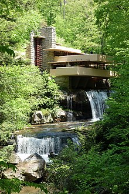
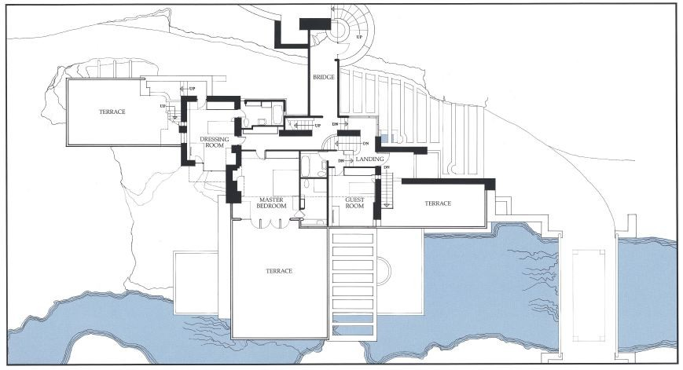
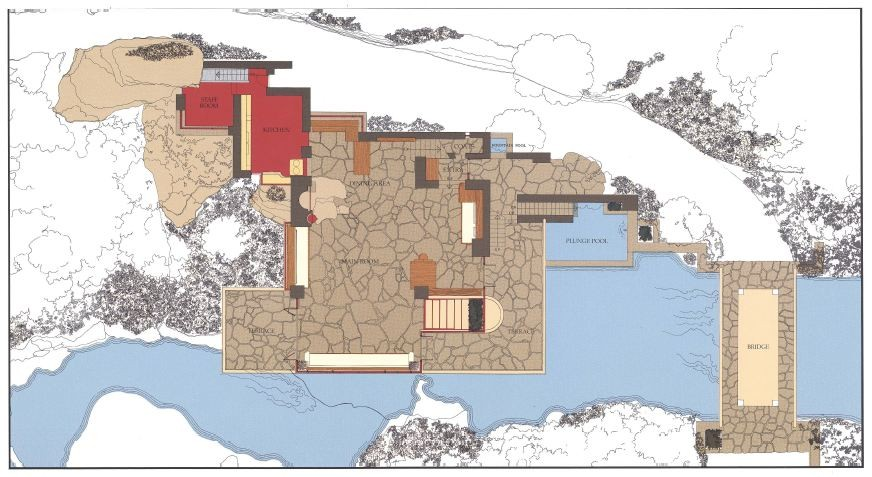
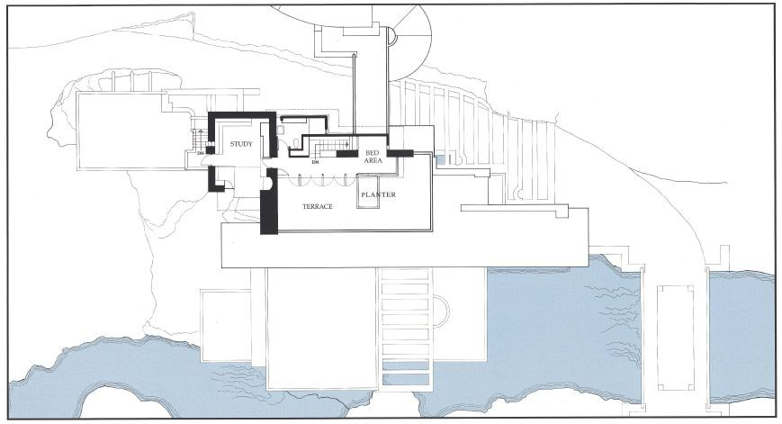
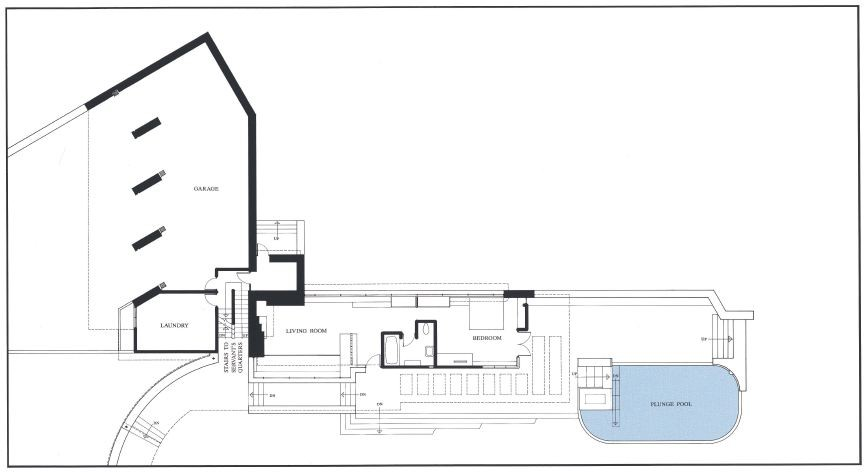
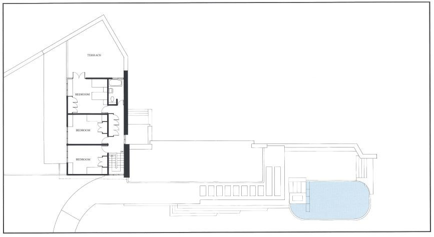

# ⛏️ Choice Exercise: Physical Design

In the tutorial, we discussed a problem that required you to design a solution. This course focuses on the design of software, but "design thinking" is something that's applicable everywhere. Throughout the term, we want to give you the opportunity to think about what good design looks like.

[Fallingwater](https://en.wikipedia.org/wiki/Fallingwater) is a house designed by Frank Lloyd Wright in 1939 in southwest Pennsylvania in the US. Its architectural design has made it a National Historical Landmark, among other awards and distinctions.

<table>
  <tr>
    <td></td>
    <td></td>
  </tr>
  <tr>
    <td></td>
    <td></td>
  </tr>
  <tr>
    <td></td>
    <td></td>
  </tr>
</table>

In this activity you will need to research into an example of good physical design - it can be anything - a house, a water bottle, a plane - anything!!

Write a blog post of around a paragraph outlining:

1. What the physical object you have chosen is;
2. What makes you or others think it is well designed; and
3. What design principles or patterns underly the design, if any.
