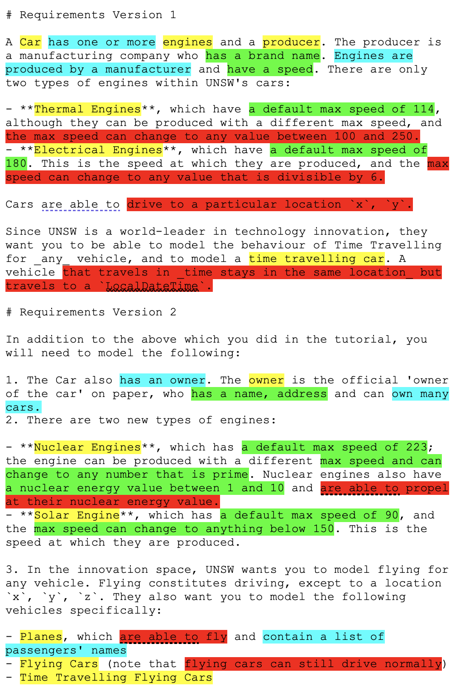
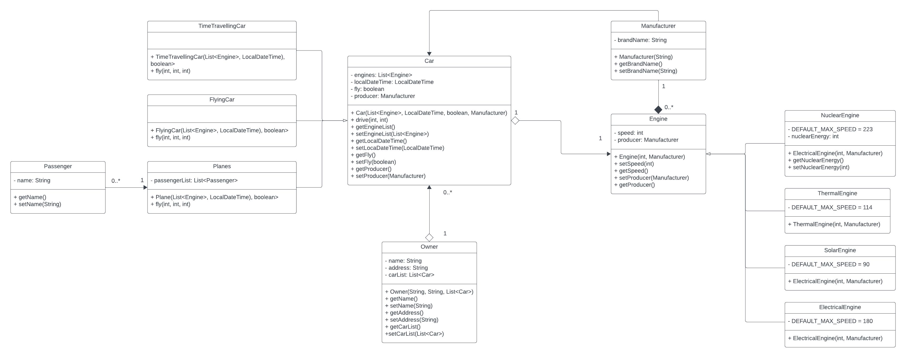

Task 1

- A Car has one or more engines.
- Car has an owner with a name and address.
- Producer manufactures engines and has a brand name.
- Engine has a max speed, and there are four types: Thermal, Electrical, Nuclear, and Solar.
- Thermal Engines have a default max speed of 114 and can have a custom max speed between 100 and 250.
- Electrical Engines have a default max speed of 180, which must be divisible by 6.
- Nuclear Engines have a default max speed of 223, which can be a prime number, and have a nuclear energy value between 1 and 10.
- Solar Engines have a default max speed of 90, which can be below 150.
- Cars can drive to a location (x, y).
- Time Travelling Cars can travel to a LocalDateTime while staying at the same location.
- Flying Cars can drive and fly.
- Planes can fly and contain a list of passengers' names.
- Time Travelling Flying Cars can time travel, drive and fly.

Task 2

I create a class Car contains these private attributes:
- engines: List<Engine>
- localDateTime: LocalDateTime
- fly: boolean
- producer: Manufacturer
for method I have drive method and attributes' getter and setter.

Then TimeTravellingCar, FlyingCar, Planes will be a subclass of Car with extra fly method.
These classes have Inheritance relationship with class Car.

I create a class Engine contains these private attributes:
- speed: int
- producer: Manufacturer
for method I have getter and setter for those attributes. This class will have 1 to 1 Aggregation relationship with class Car.

Then NuclearEngine, ThermalEngine, SolarEngine, ElectricalEngine will be a subclass of Engine with DEFAULT_MAX_SPEED.
For NuclearEngine, it has 1 more attribute which is nuclearEnergy and extra getter and setter for this attribute.
These classes have Inheritance relationship with classs Engine.

I create a class Owner contains these private attributes:
- name: String
- address: String
- carList: List<Car>
for method I have getter and setter for these attribute. This class will have 1 to 0..* Association relationship with class Car

I create a class Manufacturer contains 1 attribute brandName and for method I have getter and setter for this attribute.
This class will have 1 to 0..* Association relationship with class Car and 1 to 0..* Composition relationship with class Engine.

I create a class Passenger conatains 1 attribute name and for method I have getter and setter for this attribute.
This class will have 0..* to 1 Association relationship with class Plane.

Reflections
I will make some class become abstract class such as engine.
