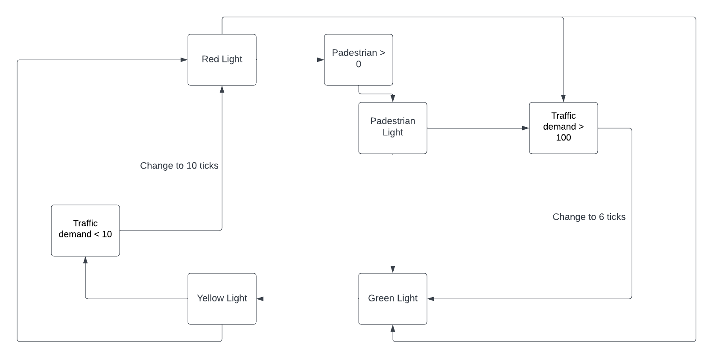

Core Exercise: Metric
Observer pattern: Grapher and Panel

Core Exercise: Traffic Light
What are the different states?
Green Light, Red Light, Yellow Light

What are the actions/transitions between each state?
Red to Green.
Green to Yellow.
Yellow to Red.

How does the initial code break the open/closed principle, and how does the state pattern fix it?
The initial code breaks this principle since it requires modification to add new functionality. The State Pattern fixes this by allowing the behavior of an object to change based on its internal state, without modifying its class.

What is the difference between the Strategy Pattern and the state pattern? What makes this an example of the State Pattern?
The State pattern deals with what (state or type) an object is.
The Strategy pattern deals with how an object performs a certain task.

Core Exercise: Check-in
How do you think you are going in the course?
Everything is all good
What has been the most difficult/challenging part of the course so far?
I need to remember and apply design patterns.
Look back at the goals you set in Week 1. How are they tracking?
They are on the track.
What is one thing you want to improve for the second half of the term?
I will read leture sides and lecture code after lecture live stream.