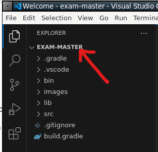

# 23T3 Sample Final Exam <!-- omit in toc -->

Answers all of the questions.

> Please note the purpose of the sample exam is to get you familiar with the layout and the exam environment.
>
> It is **not representative of the topics that will be covered in the final exam, or the difficulty of the final exam.**
>
> If you have any questions about how the exam environment works, you should ask your tutor now.

- [Exam Environment Explanation](#exam-environment-explanation)
  - [Submission: Section 1 - Multiple Choice](#submission-section-1---multiple-choice)
  - [Submission: Section 2 - Short Answer](#submission-section-2---short-answer)
  - [Submission: Section 3 - Design \& Programming](#submission-section-3---design--programming)
    - [Section 3 - VSCode Quick Fix](#section-3---vscode-quick-fix)
    - [Section 3 - VSCode Debugging](#section-3---vscode-debugging)
- [Part 1: Multiple Choice (25 Marks)](#part-1-multiple-choice-25-marks)
  - [Question 1 (2 marks)](#question-1-2-marks)
  - [Question 2 (2 marks)](#question-2-2-marks)
  - [Question 3 (2 marks)](#question-3-2-marks)
  - [And more questions...](#and-more-questions)
- [Part 2: Short Answer (25 Marks)](#part-2-short-answer-25-marks)
  - [Question 4 (2 marks)](#question-4-2-marks)
  - [Question 5 (4 marks)](#question-5-4-marks)
  - [Question 6 (2 marks)](#question-6-2-marks)
  - [And more questions...](#and-more-questions-1)
- [Part 3: Design \& Programming (50 marks)](#part-3-design--programming-50-marks)
  - [Question 7 (10 Marks)](#question-7-10-marks)
  - [Question 8 (35 marks)](#question-8-35-marks)
    - [a) Code Analysis (5 Marks)](#a-code-analysis-5-marks)
    - [b) Refactoring a Method (3 marks)](#b-refactoring-a-method-3-marks)
    - [c) Refactoring the Design (9 marks)](#c-refactoring-the-design-9-marks)
    - [d) Filtering Authorisation (9 marks)](#d-filtering-authorisation-9-marks)
    - [e) Factory Pattern (9 marks)](#e-factory-pattern-9-marks)
    - [f) \[EXTRA\] Singleton Pattern (9 marks)](#f-extra-singleton-pattern-9-marks)
  - [And more questions...](#and-more-questions-2)
- [End of Exam](#end-of-exam)

The following files (lecture slides and lecture demo code from the relevant lectures) are available during the exam. You can use them to develop your solutions; please cite them. You can access these files by changing to the following directory.

```bash
$ cd /home/class/public_html/exam_files/
$ ls -l
```

# Exam Environment Explanation

Upon opening the exam, you will be presented with the exam specification document open in a browser.

To open a terminal, navigate to the bottom left of your screen and click the `>` button:


This will open up a dropdown where you can select an `XTerm` terminal to be opened. There are some variations of this, but they all have the same functionality.

Using `ls -la` you can list all the contents in your exam directory. It should follow the structure of the following:

```
.
├── exam-master
│   ├── bin
│   ├── build.gradle
│   ├── images
│   ├── lib
│   └── src
├── mcq
│   ├── q01.txt
│   ├── q02.txt
│   └── q03.txt
├── q4.txt
├── q5.txt
├── q6.txt
└── submitted
```

Key files and folders:

- `exam-master`: This folder is a Java codebase for **section 3 only**. Open this folder in VSCode to access the codebase (e.g., `code ~/exam-master`)
- `q*.txt`: The text files are for **section 2 only**. You can edit these files in VSCode then submit them following the instructions on the paper.
- `mcq`: This folder can be ignored. Do not modify
- `submitted`: A folder **generated after your first submission** that contains the answers you have submitted. Do not modify. See more info below.

## Submission: Section 1 - Multiple Choice

To submit your answers for section 1, you will need to use the `submit` command in the terminal. The full command is specified under each question.

For example, if you want to submit your answer for Question 1, you would run the following command `submit mc 1`. This will bring up a prompt asking for your answer:

```
Please refer to the Exam paper for the question description for Question 1.

[A] Aggregation.
[B] Composition.
[C] Neither.
Answer (A-C inclusive):
```

You must type in a valid answer and hit enter on your keyboard. After doing so, an output of your answer will be printed to the terminal to confirm:

```
Please refer to the Exam paper for the question description for Question 1.

[A] Aggregation.
[B] Composition.
[C] Neither.
Answer (A-C inclusive): A
A copy of your submitted answer is in your '~/submitted' directory
Multiple choice responses
=========================
Question 01: [A] Aggregation.
Question 02: (no response)
Question 03: (no response)
... and so on
=========================
```

## Submission: Section 2 - Short Answer

> To write your answer, you can open the respective text (`.txt`) file using VSCode. For example, if you were working on Question 4, you can do this by running the following commands:
>
> ```bash
> code ~/q4.txt
> ```

After you have written your response, **make sure you save the file.**.

> VSCode provides an indicator if a file has unsaved changes. See the images below:
>
> 
>
> Note the 'X' symbol next to the file name `q4.txt`. This indicates that the file has been saved and has no unsaved changes. **You should only submit when you see this.**
>
> 
>
> Note the `*` (or circle) symbol next to the file name `q4.txt`. This indicates that the file has unsaved changes. **You should save the file before running the submit command**.

Then follow the instructions and run the submission command. For example, if you wanted to submit Question 4, you would run the command: `submit q4`. You should also see the following output after:

```
A copy of your submitted file is in your '~/submitted' directory
Submission of q4.txt for task q4 accepted
```

You can view a copy of what you have submitted by running the following command:

```bash
cat ~/submitted/q4.txt
```

> Note: Do not modify any files within the `~/submitted` directory. If you want to make changes to your answer, edit the corresponding `.txt` file and re-run the submission command.

## Submission: Section 3 - Design & Programming

> To get started, ensure you have opened VSCode within the `exam-master` directory. **This is extremely important in order for Gradle, Java, and VSCode to work together**. You can run the following command to ensure you open vscode correctly: `code ~/exam-master`
>
> VSCode also indicates which folder you have open in the top left of the editor. See the red arrow in the image below:
>
> 
>
> If it does not say `exam-master` where the red arrow is pointing, then you have opened VSCode in the wrong directory. Try the command again.

After completing the question, follow the instructions and run the submission command. For example if you wanted to submit Question 8, you would run hte command `submit q8`. You should see the following output after:

```
q8/
q8/GitlabAuthorisationException.java
q8/GitlabFactory.java
q8/GitlabGroup.java
q8/GitlabPermissionsNode.java
q8/GitlabProject.java
q8/GitlabRunner.java
q8/PermissionsLevel.java
q8/User.java
q8/q8.txt
A copy of your submitted file is in your '~/submitted' directory
Submission of q8_last_submission.tar for task q8 accepted.
```

> Note: Do not modify any files within the `~/submitted` directory. If you want to make changes to your answer, edit the corresponding `.txt` file and re-run the submission command.

### Section 3 - VSCode Quick Fix

To use the quick fix option on VSCode (or the IntelliSense lightbulb), move the cursor to the place you want to trigger it, then hit `control + .` to open up the dropdown.


### Section 3 - VSCode Debugging

If you suffer any issues with VSCode, you should always

1. Make sure you have `exam-master` open in VSCode. See the [instructions above](submission-section-3---design--programming).
2. Try and clear the java environment. See below for instructions.

> Open up the command palette using `control + shift + p` and search for `java clean` then hit enter & restart VSCode.
>
> 

3. Ask your invigilator for help.

# Part 1: Multiple Choice (25 Marks)

## Question 1 (2 marks)

On a bike, there are one or more tyres.

The following relationship is an example of:

- A) Aggregation
- B) Composition
- C) Neither

**Submit your answer using the following command:**

### `submit mc 1` <!-- omit in toc -->

## Question 2 (2 marks)

Consider the following lambda function which prints log. The type signature has been redacted.

`[redacted] logger = log -> System.out.println(log);`

Pick the most semantically correct type from the list below:

- A) `Function<String, Boolean>`
- B) `Consumer<String>`
- C) `Predicate<String>`
- D) `Supplier<String>`

**Submit your answer using the following command:**

### `submit mc 2` <!-- omit in toc -->

## Question 3 (2 marks)

Which design pattern is most appropriate for the following scenario.

You have a program that needs to print error messages from multiple methods. All such error messages must be sent to the file called “error.txt”.

- A) Factory
- B) Strategy
- C) Singleton
- D) Visitor
- E) Adaptor

**Submit your answer using the following command:**

### `submit mc 3` <!-- omit in toc -->

## And more questions...

# Part 2: Short Answer (25 Marks)

## Question 4 (2 marks)

Is the following an example of aggregation or composition? Explain why.

> An online call contains breakout rooms.

Write your answer inside `q4.txt`.

**Submit your answer using the following command:**

### `submit q4` <!-- omit in toc -->

## Question 5 (4 marks)

Consider the following code:

```java
public class Student {
    /**
     * Schedules a student's class for a specific time.
     * @preconditions - Start and end are between 9am and 5pm, start < end
     * @postconditions - If there is an available class at that time, the class is scheduled
     *                 - If there is no available class at that time, the nearest class outside those times is scheduled
     */
    public void scheduleClass(LocalTime start, LocalTime end) {
    }
}

public class UNSWStudent extends Student {
    /**
     * Schedules a UNSW-timetabled class for a specific time.
     * @preconditions - Start and end are between 9am and 9pm, start < end
     * @postconditions - If there is an available class at that time, the class is scheduled
     *                 - If there is no available class at that time, nothing happens
     */
    public void scheduleClass(LocalTime start, LocalTime end) throws UnsuccessfulSchedulingException {
    }
}
```

Is this valid inheritance? Conceptually justify your answer.

Write your answer inside `q5.txt`.

**Submit your answer using the following command:**

### `submit q5` <!-- omit in toc -->

## Question 6 (2 marks)

Consider the generic Stack class from Tute 08, where we have modified the type signature to be the following:

```java
public class Stack<E extends Collection<E>> implements Iterable<E>
```

When we try to declare a new stack of strings, we are now given a compilation error:

```java
Stack<String> stack = new Stack<String>();
// Bound mismatch: The type String is not a valid substitute for
// the bounded parameter <E extends Collection<E>> of the type Stack<E>
```

Explain why this error occurs.

Write your answer inside `q6.txt`.

**Submit your answer using the following command:**

### `submit q6` <!-- omit in toc -->

## And more questions...

# Part 3: Design & Programming (50 marks)

> Your code for every part of this section needs to compile. **This includes Question 7**. If your code fails to compile, since everything is in the same directory, the gradle build will fail and none of the automarking will run.
>
> To check whether your code compiles, run `gradle test`. You don't need to pass all of the tests, they just need to run. See an example below.
>
> 

> You need to be inside the `exam-master` folder for VScode to configure itself properly.
>
> Open a terminal and run `code ~/exam-master`

## Question 7 (10 Marks)

With a return to in-person exams, CSE has decided to build a system that will allow for exams to be administered. The system has the following functional requirements:

- An exam has a series of centres allocated to it, for example J17 Ainsworth, K17 CSE, etc.
- Each centre has one or more classrooms, for example Bongo, Lyre, Viola.
- Each centre has a supervisor, which is a staff member;
- Each classroom has an invigilator, which is also a staff member, as well as a maximum capacity;
- Students can be added to classrooms or removed from classrooms;

Model the domain for the above requirements to form the basis of a potential software solution. Your answer should include:

- Interfaces, if applicable
- Class Signatures, including inheritance relationships where appropriate
- Method Signatures
- Key Fields and relationships, including aggregations, compositions and cardinalities between entities (written as comments)

**You do not need to implement any of these classes/methods, you are simply providing the prototypes / stubs**. Any design decisions that you feel need justifying you can do so as a comment / JavaDoc in the respective Java file.

**Do not draw a UML diagram for this question.**

An interface for the entire system has been provided to you in `src/main/java/q7/ExamSystemController.java`. You can modify these method prototypes if you like, though you shouldn't need to.

There is a _lot_ of undefined behaviour about this system, which is intentional. You can make as many assumptions as you need, so long as they don't reduce the scope of the specification.

You will be assessed on:

- Modelling of Entities (4 marks)
- Aggregations, Compositions and Cardinalities (3 marks)
- Modelling of Functionality (3 marks)

**Submit your answer using the following command:**

### `submit q7` <!-- omit in toc -->

## Question 8 (35 marks)

In Gitlab, there are two types of "nodes" in a structural tree of permissions and access - **groups** and **projects**.

- **Groups** are nodes that can contain projects, or other subgroups;
- **Projects** are nodes that do not have any subgroups or subprojects, and act as a code repository


In the above example, the tree consists of the COMP2511 group which contains the 22T2 group, which contains STAFF group which contains the tutor-notes project, other projects and another group called repos.

At each level, a user can have one of four different types of **permissions**:

- Owner
- Maintainer
- Developer
- Reporter

For the purposes of this question, the only actions that will require permissions are:

- Creating a project, which requires Developer permissions
- Creating a subgroup, which requires Maintainer permissions
- Changing the permissions of another member in the group, which requires Owner Permissions

Inside `src/main/java/q8` we have implemented a very basic system that addresses the above requirements. In this question you will be required to **analyse the existing code, make notes of design smells and refactor the code, and adapt the code to an evolution in the requirements.**

There are a series of regression tests that currently pass on the code in `RegressionsTests` within `GitlabTest.java`.

### a) Code Analysis (5 Marks)

Look at the code inside the `q8` package and in `q8.txt` answer the following questions:

1. Explain what Design Pattern is being used to represent the system, and how the domain relates to the key characteristics of the pattern. (2 marks)
2. Identify what you think is the main design problem present in the existing code, including what smells are indicating the problem. (2 marks)
3. Which of the following design smells is also present in the code? (1 mark)

- Divergent Change
- Inappropriate Intimacy
- Refused Bequest
- Message Chains

### b) Refactoring a Method (3 marks)

Refactor the following method inside `GitlabGroup` to use streams:

```java
public List<String> getUsersOfPermissionLevel(PermissionsLevel level) {
    Set<User> membersSet = members.keySet();
    List<String> names = new ArrayList<String>();

    for (User member : membersSet) {
        if (members.get(member).equals(level)) {
            names.add(member.getName());
        }
    }

    return names;
}
```

In your refactoring, you will need to keep the regression tests passing, which are provided in `RegressionsTests` within `GitlabTest.java`.

### c) Refactoring the Design (9 marks)

Based on your notes on Design Smells from Part A, refactor the design of the system accordingly.

You can make any changes as you like, so long as you keep the regression tests passing, which are provided in `RegressionsTests` within `GitlabTest.java`.

Any notes you wish to make regarding your refactoring can go inside `q8.txt`.

The mark breakdown for this question is as follows:

- Maintaining Correctness (1 mark)
- Refactoring (8 marks)

### d) Filtering Authorisation (9 marks)

Currently, there is a major flaw in our implementation - the system does not **filter** permissions from groups to all their subgroups and projects.

For example, if Claire is the owner of the COMP2511 group, then she is also the owner of the 22T2 group, the STAFF group and the tutor-notes project and has the same Owner permissions on those groups as if she was a direct owner of those respective nodes.

Similarly, if a user tries to give permissions to another user in a group which, by filtering authorisation they **already** have permissions on, a `GitlabAuthorisationException` should be thrown.

In code, here is an illustration of the above description:

```java
User user = new User("Claire");
User user2 = new User("Eddie");

// Create a group
GitlabPermissionsNode group = new GitlabGroup("COMP2511", user);
// Create a subgroup
GitlabPermissionsNode group2 = assertDoesNotThrow(() -> group.createSubgroup("22T2", user));
// Give dev access to Eddie on the COMP2511 group
assertDoesNotThrow(() -> group.updateUserPermissions(user2, PermissionsLevel.DEVELOPER, user));
// Check that Eddie also has dev access on the 22T2 group
assertEquals(PermissionsLevel.DEVELOPER, group2.getUserPermissions(user2));
// Try to give Eddie reporter access on the 22T2 group, but he is already a developer of COMP2511
// so an authorisation error is thrown
assertThrows(GitlabAuthorisationException.class,
    () -> group2.updateUserPermissions(user2, PermissionsLevel.REPORTER, user));
```

Implement the 'filtering' of authorisation. A basic test has been provided to you in `PartDFilteringAuthorisationTests` within `GitlabTest.java`. We will run further tests on this question to assess the correctness of your solution.

The mark breakdown for this question is as follows:

- Correctness (5 marks)
- Design (4 marks)

Any notes you wish to make regarding your design can go inside `q8.txt`.

### e) Factory Pattern (9 marks)

Inside `GitlabFactory.java`, implement the following method:

```java
public static GitlabPermissionsNode gitlabFromJson(String jsonString, User user)
```

The `gitlabFromJson` method should take in a string of the following format:

```json
{
  "type": "group",
  "name": "COMP2511",
  "subgroups": [
    {
      "type": "group",
      "name": "22T2",
      "subgroups": [
        {
          "type": "project",
          "name": "dungeonmania"
        }
      ]
    },
    {
      "type": "project",
      "name": "blackout"
    }
  ]
}
```

and produce a `GitlabPermissionsNode` with the corresponding structure. You do not need to handle any processing of group/project members in this part of the question.

A basic test has been provided to you in `PartEFactoryTests` within `GitlabTest.java`. We will run further tests on this question to assess the correctness of your solution.

Any notes you wish to make regarding your design can go inside `q8.txt`.

The mark breakdown for this question is as follows:

- Correctness (5 marks)
- Design (4 marks)

**Submit your answer using the following command:**

### `submit q8` <!-- omit in toc -->

### f) [EXTRA] Singleton Pattern (9 marks)

> This is an alternative question to [task e)](#e-factory-pattern-9-marks)

All projects in Gitlab run their pipelines on a single machine, which is why the runner gets very slow around project and assignment deadlines.

Currently, the `runPipeline` method inside `GitlabProject`, which takes in an runnable "process" creates a new instance of the runner and runs the job.

```java
public void runPipeline(Runnable job) {
    GitlabRunner runner = new GitlabRunner();
    runner.run(job);
}
```

Refactor the code to use the **Singleton Pattern** so that only one instance of the `GitlabRunner` exists and only one job is able to run at a time (i.e. only one `run` call can be made at a time).

A basic test has been provided to you in `PartFSingletonTests` within `GitlabTest.java`. We will run further tests on this question to assess the correctness of your solution.

Any notes you wish to make regarding your design can go inside `q8.txt.

The mark breakdown for this question is as follows:

- Correctness (5 marks)
- Design (4 marks)

**Submit your answer using the following command:**

### `submit q8` <!-- omit in toc -->

## And more questions...

# End of Exam
